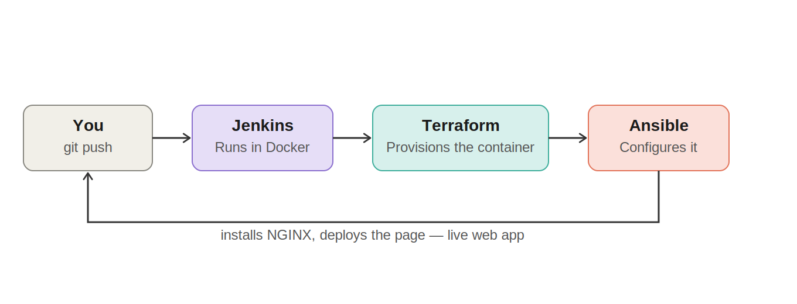

# Infrastructure as Code & Automated CI/CD Sandbox

A fully automated pipeline that provisions an environment from scratch, configures it, and deploys a web
page — triggered automatically on every `git push`. No cloud provider account required to reproduce it.

Built as the second project of an 8-week Cloud Engineering internship. Runs entirely on a single Ubuntu
server, with containers standing in for VMs after discovering the server had no hardware virtualization
exposed — see [Environment decision](#environment-decision) below.

## Architecture



A `git push` triggers Jenkins (via SCM polling), which runs Terraform to provision the environment and
Ansible to configure it — installing NGINX and deploying the page, fully automatically.

## Tech stack

| Layer | Tool | Purpose |
|---|---|---|
| Provisioning | Terraform (`kreuzwerker/docker` provider) | Creates the environment (a Docker container standing in for a VM) |
| Configuration | Ansible | Installs NGINX, deploys the page |
| CI/CD | Jenkins (in Docker) | Orchestrates the pipeline, triggers on every `git push` |
| Target | Docker container (`ubuntu:22.04`) | The provisioned "VM" |

## Quick start

```bash
git clone <this-repo-url>
cd <this-repo>
./deploy.sh
```

This provisions the environment and deploys the page in one command. It's idempotent — safe to run
repeatedly, since it removes any existing environment before creating a fresh one. The page will be live at
`http://localhost:8081` (or your server's IP, if run remotely).

## Running it via Jenkins instead

1. Run Jenkins with access to the host's Docker socket:
   ```bash
   docker run -d --name jenkins -p 8082:8080 -p 50000:50000 \
     -v jenkins_home:/var/jenkins_home \
     -v /var/run/docker.sock:/var/run/docker.sock \
     jenkins/jenkins:lts
   ```
2. Install Terraform, Ansible, and the Docker CLI inside the Jenkins container (see `docs/jenkins-setup.md`
   for the exact commands and the socket-permission fix needed).
3. Create a Pipeline job pointing at this repo, using **"Pipeline script from SCM"** with the `Jenkinsfile`
   in this repo.
4. Enable **Poll SCM** (`H/2 * * * *`) under Build Triggers, so Jenkins checks for new commits every 2
   minutes and runs the pipeline automatically — no manual "Build Now" needed, and no inbound webhook
   exposure required on the server.

## Environment decision

The original spec suggested Vagrant + VirtualBox for provisioning. Before committing to that, hardware
virtualization support was checked directly on the target server:

```bash
egrep -c '(vmx|svm)' /proc/cpuinfo
```

The result was `0` — not uncommon on budget cloud VPS instances, which often don't expose nested
virtualization to guest VMs. Rather than fight that limitation, Terraform's Docker provider is used to
provision containers instead of real VMs — a legitimate, widely-used pattern for CI and resource-constrained
labs that demonstrates the same core skills (declarative provisioning, automated configuration) without
needing hardware virtualization.

## Notable debugging stories

**`sudo: not found`.** The Ansible playbook used `become: true` to escalate privileges, but the minimal
`ubuntu:22.04` image has no `sudo` binary. The real fix wasn't installing `sudo` — since Ansible connects
via the Docker connection plugin and no user was set on the container, commands already run as root. There
was nothing to escalate to; `become: true` was simply unnecessary.

**Terraform state split-brain.** Automated builds intermittently failed with `Conflict: the container name
"/web-vm" is already in use`, even though Terraform's own plan said it had nothing to destroy. Root cause:
two independent Terraform state files existed — one in a manually-maintained local folder, one in Jenkins'
own workspace — each unaware of what the other had done. Worse, an early commit had accidentally included
`terraform.tfstate` in version control, so every fresh Jenkins checkout silently reset progress by
overwriting the workspace's real state with that stale, committed copy.

Rather than trying to keep multiple state files perfectly synchronized (fragile, especially across CI
workspaces that aren't guaranteed to persist), both entry points (`deploy.sh` and the `Jenkinsfile`) were
made **idempotent**: each removes any existing container before provisioning
(`docker rm -f web-vm 2>/dev/null || true`), so every run starts from a guaranteed-known state regardless of
what any state file claims happened before.

**No Python on a fresh container.** Ansible's standard modules require Python on the target, but a bare
`ubuntu:22.04` container has none. Fixed by using Ansible's `raw` module (which has no Python dependency)
as a `pre_task` to bootstrap Python before the rest of the playbook runs — making the playbook fully
self-contained instead of relying on a one-off manual command.

**Jenkins → Docker socket permission denied.** Mounting the host's Docker socket into the Jenkins container
isn't enough on its own — the socket's group ownership on the host didn't exist inside the container. Fixed
by creating a matching group (same GID) inside the Jenkins container and adding the `jenkins` user to it.

## Key learnings

- Always verify hardware virtualization support before committing to a VM-based provisioning tool on a
  cloud server — many budget providers don't expose it.
- Terraform state must be owned by a single source of truth. Running the same config from two different
  locations causes each to lose track of what the other has done.
- For disposable CI infrastructure, designing each entry point to be idempotent is more robust than trying
  to keep state files perfectly synchronized across environments.
- `become: true` is unnecessary — and will fail on minimal images — when the connection already executes
  as root, as is the default for Docker connections.
- Poll SCM is a reasonable, lower-exposure alternative to GitHub webhooks for a Jenkins instance that isn't
  meant to be reachable from the public internet.

## What's in this repo

```
terraform/          Terraform config (Docker provider) — provisions the container
ansible/             Playbook + inventory — configures NGINX and deploys the page
Jenkinsfile          Pipeline definition: cleanup -> provision -> configure
deploy.sh            Single-command version of the same pipeline, run manually
architecture/        Pipeline diagram
docs/                Setup notes, screenshots
```

## License

MIT
